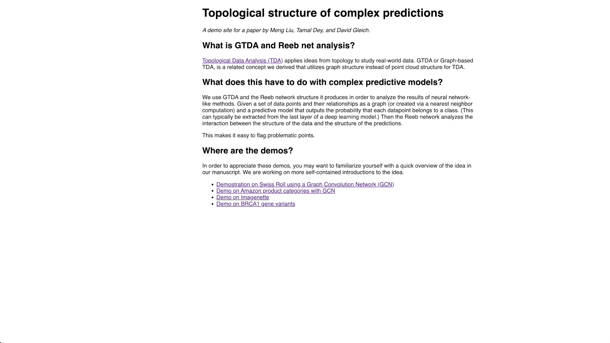
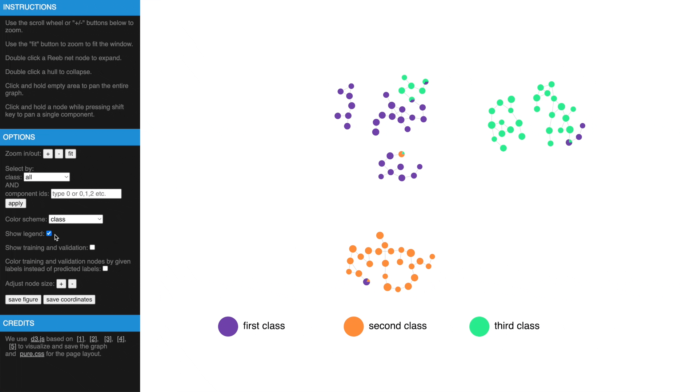
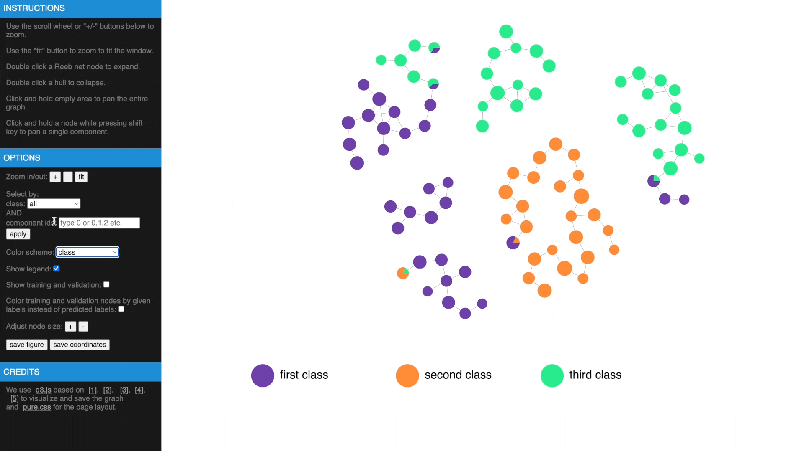

[](https://zenodo.org/badge/latestdoi/490417151)

# Graph-Topological-Data-Analysis
This repo contains code for [Topological structure of complex predictions](https://arxiv.org/abs/2207.14358). 
### packages requirement
* pytorch (with cuda)
* torchvision
* scikit-learn
* numpy
* scipy
* timm
* tqdm
* torch_geometric
* networkx
* seaborn
* rembg

### install using conda
The easiest way to setup the environment required by GTDA is to use the included ```GTDA.yml``` file. Run this file with the following command:

```conda env create --file GTDA.yml```

which will create a virtual environment under the current working directory. The installation can take up to one or two hours depending on network speed. Then, the code can be run after activating the conda environment using the following command:

```conda activate GTDA```

### create a Reeb network

```python
from GTDA.GTDA_utils import compute_reeb, NN_model
from GTDA.GTDA import GTDA

nn_model = NN_model()
nn_model.A = G # graph to analyze, in scipy csr format
nn_model.preds = preds # prediction matrix, samples-by-class
nn_model.labels = labels # integer class assignments starting from 0
nn_model.train_mask = train_mask # training mask in bool
nn_model.val_mask = val_mask # validation mask in bool
nn_model.test_mask = test_mask # testing mask in bool
smallest_component = 20
overlap = 0.1
labels_to_eval = list(range(preds.shape[1]))
GTDA_record = compute_reeb(GTDA,nn_model,labels_to_eval,smallest_component,overlap,
    node_size_thd=5,reeb_component_thd=5,nprocs=10,device='cuda')
```
### analyze a Reeb network
```python
g_reeb = GTDA_record['g_reeb'] # Reeb network in csr format
gtda = GTDA_record['gtda'] # an instance of GTDA class
gtda.final_components_filtered[gtda.filtered_nodes[reeb_node_index]] # map a reeb node back to the original component
gtda.A_reeb # projected Reeb network with the same set of nodes as the original graph
gtda.sample_colors_mixing # GTDA estimated errors for each sample
```

## Swiss Roll experiment (demo)
### Prerequisites: 
None, self contained
### Files: 
* ```train_swiss_roll.py``` generates the dataset and trains the model

* ```analyze_swiss_roll.ipynb``` creates and analyzes Reeb network 
* ```dataset/precomputed/swiss_roll``` contains precomputed lens and graph to run ```analyze_swiss_roll.ipynb``` directly


### Expected running time:
* A few minutes.


## Amazon Electronics experiment
### Prerequisites:
Download All products under 'Electronics' from the 2014 version of Amazon reviews data from <http://jmcauley.ucsd.edu/data/amazon/index_2014.html> and put under ```dataset/electronics``` folder
### Files: 
* ```train_electronics.py``` generates the dataset and trains the model

* ```analyze_electronics.ipynb``` creates and analyzes Reeb network 
* ```dataset/precomputed/electronics``` contains precomputed lens and graph to run ```analyze_electronics.ipynb``` directly

## Imagenette experiment
### Prerequisites:
Download from <https://github.com/fastai/imagenette> and put under ```dataset/imagenette``` folder
### Files: 
* ```train_imagenette.py``` generates the dataset and trains the model

* ```analyze_imagenette.ipynb``` creates and analyzes Reeb network 
* ```dataset/precomputed/imagenette``` contains precomputed lens and graph to run ```analyze_imagenette.ipynb``` directly

## Gene mutation experiment
### Prerequisites:
Download ```variant_summary.txt``` from <https://ftp.ncbi.nlm.nih.gov/pub/clinvar/tab_delimited/> and put under ```dataset/variants``` folder 

Download human reference genome ```hg19.fa```, ```hg38.fa``` and put under ```dataset/variants``` folder 

Install ```tensorflow``` and setup ```Enformer``` based on instructions of <https://github.com/deepmind/deepmind-research/tree/master/enformer>. GPU with cuda support is highly recommended.

### Files: 
* ```mutation_dataset.py``` preprocesses downloaded files, tensorflow is required
* ```train_gene_mutation.py``` generates the dataset and trains the model

* ```analyze_gene_mutation.ipynb``` creates and analyzes Reeb network 
* ```dataset/precomputed/variants``` contains precomputed lens and graph to run ```analyze_gene_mutation.ipynb``` directly

## Additional experiments in supplement
### Prerequisites:
To run the CNN model comparison experiment, all training and validation images of ImageNet-1k dataset must be downloaded from <https://www.image-net.org/> and put under ```dataset/imagenet_1k```. The folder should be organized as:

```
dataset/imagenet_1k/
    train/
        class1/
            img1
            img2
            ...
        class2/
        ...
    val/
        class1/
            img1
            img2
            ...
        class2/
        ...
```

 It also requires to install ```timm``` package to get the pretrained VOLO model.

To run the chest X-ray experiment, all X-ray images and expert labels should be downloaded from <https://cloud.google.com/healthcare-api/docs/resources/public-datasets/nih-chest>. The images should be put under ```dataset/chest_xray/images``` and expert labels under ```dataset/chest_xray```. We also use the implementation from <https://github.com/zoogzog/chexnet> to train a DenseNet-121 model.
### Files: 
* ```train_analyze_imagenet_1k.py``` preprocesses downloaded files and build the Reeb network
* ```train_chest_xray.py``` preprocesses downloaded files, train a DenseNet-121 model from scratch, build the Reeb network and ```analyze_chest_xray.ipynb``` uses precomputed data to find potential labeling errors for images with expert labels

## Interactive web interface for better exploration
Once we have computed the Reeb net, other than examing the results in traditional figures, we have also created an interactive web interface using D3 library to explore the results in a web browser. To transform the GTDA results into the format compatible with the web interface, the following function needs to be called:

```python
from GTDA.GTDA_utils import save_to_json
savepath = "web/"
save_to_json(GTDA_record, nn_model, savepath)
```
This function will save the results to ```web/reeb_net.js```. Currently, this interface doesn't support another filename as ```reeb_net.js``` is hard coded in the code. This is to facilitate running the interface locally. Once the function is called, we can open ```web/index.html``` to explore the results. 

### Demos:
<https://mengliupurdue.github.io/Graph-Topological-Data-Analysis/> 

<!--
-->
### Supported operations:

* Hover over a node to get more information, show or hide legend

<!-- 
-->
* Use mouse wheel or buttons to zoom, move and fit to window, click and hold a node to drag to tweak layout

 

* Drag while pressing SHIFT to pan components, use buttons to change node size

 

* Check estimated errors or true errors, filter components by class or id



* Expand to samples or collapse to Reeb net nodes, understand estimated errors by highlighting training/validation


