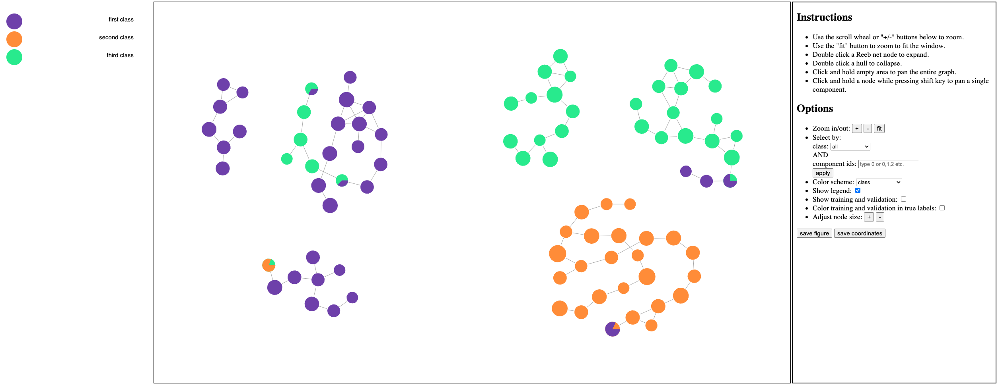
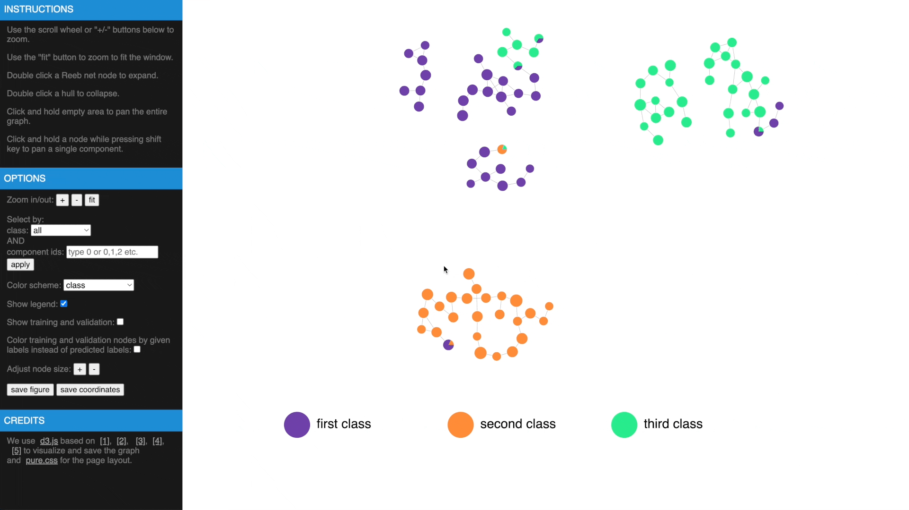

# Graph-Topological-Data-Analysis
This repo contains code for "Topological structure of complex predictions". 
### packages requirement
* pytorch
* torchvision
* scikit-learn
* numpy
* scipy
* timm
* tqdm
* torch_geometric
* networkx
* seaborn
* rembg

### create a Reeb network

```python
from GTDA.GTDA_utils import compute_reeb, NN_model
from GTDA.GTDA import GTDA

nn_model = NN_model()
nn_model.A = G # graph to analyze, in scipy csr format
nn_model.preds = preds # prediction matrix, samples-by-class
nn_model.labels = labels # integer class assignments starting from 0
nn_model.train_mask = train_mask # training mask in bool
nn_model.val_mask = val_mask # validation mask in bool
nn_model.test_mask = test_mask # testing mask in bool
smallest_component = 20
overlap = 0.1
labels_to_eval = list(range(preds.shape[1]))
GTDA_record = compute_reeb(GTDA,nn_model,labels_to_eval,smallest_component,overlap,
    node_size_thd=5,reeb_component_thd=5,nprocs=10,device='cuda')
```
### analyze a Reeb network
```python
g_reeb = GTDA_record['g_reeb'] # Reeb network in csr format
gtda = GTDA_record['gtda'] # an instance of GTDA class
gtda.final_components_filtered[gtda.filtered_nodes[reeb_node_index]] # map a reeb node back to the original component
gtda.A_reeb # projected Reeb network with the same set of nodes as the original graph
gtda.sample_colors_mixing # GTDA estimated errors for each sample
```

## Swiss Roll experiment
### Prerequisites: 
None, self contained
### Files: 
* ```train_swiss_roll.py``` generates the dataset and trains the model

* ```analyze_swiss_roll.ipynb``` creates and analyzes Reeb network 
* ```dataset/precomputed/swiss_roll``` contains precomputed lens and graph to run ```analyze_swiss_roll.ipynb``` directly


## Amazon Electronics experiment
### Prerequisites:
Download All products under 'Electronics' from the 2014 version of Amazon reviews data from <http://jmcauley.ucsd.edu/data/amazon/index_2014.html> and put under ```dataset/electronics``` folder
### Files: 
* ```train_electronics.py``` generates the dataset and trains the model

* ```analyze_electronics.ipynb``` creates and analyzes Reeb network 
* ```dataset/precomputed/electronics``` contains precomputed lens and graph to run ```analyze_electronics.ipynb``` directly

## Imagenette experiment
### Prerequisites:
Download from <https://github.com/fastai/imagenette> and put under ```dataset/imagenette``` folder
### Files: 
* ```train_imagenette.py``` generates the dataset and trains the model

* ```analyze_imagenette.ipynb``` creates and analyzes Reeb network 
* ```dataset/precomputed/imagenette``` contains precomputed lens and graph to run ```analyze_imagenette.ipynb``` directly

## Gene mutation experiment
### Prerequisites:
Download ```variant_summary.txt``` from <https://ftp.ncbi.nlm.nih.gov/pub/clinvar/tab_delimited/> and put under ```dataset/variants``` folder 

Download human reference genome ```hg19.fa```, ```hg38.fa``` and put under ```dataset/variants``` folder 
### Files: 
* ```mutation_dataset.py``` preprocesses downloaded files, tensorflow is required
* ```train_gene_mutation.py``` generates the dataset and trains the model

* ```analyze_gene_mutation.ipynb``` creates and analyzes Reeb network 
* ```dataset/precomputed/variants``` contains precomputed lens and graph to run ```analyze_gene_mutation.ipynb``` directly

## Additional experiments in supplement
### Prerequisites:
To run the CNN model comparison experiment, all training and validation images of ImageNet-1k dataset must be downloaded from <https://www.image-net.org/>. It also requires to install ```timm``` package to get the pretrained VOLO model.

To run the chest X-ray experiment, all X-ray images and expert labels should be downloaded from <https://cloud.google.com/healthcare-api/docs/resources/public-datasets/nih-chest>. We also use the implementation from <https://github.com/zoogzog/chexnet> to train a DenseNet-121 model.
### Files: 
* ```train_analyze_imagenet_1k.py``` preprocesses downloaded files and build the Reeb network
* ```train_analyze_chest_xray.py``` preprocesses downloaded files, train a DenseNet-121 model from scratch, build the Reeb network and find potential labeling errors for images with expert labels

## Interactive web interface for better exploration
Once we have computed the Reeb net, other than examing the results in traditional figures, we have also created an interactive web interface using D3 library to explore the results in a web browser. To transform the GTDA results into the format compatible with the web interface, the following function needs to be called:

```python
from GTDA.GTDA_utils import save_to_json
savepath = "web/"
save_to_json(GTDA_record, nn_model, savepath)
```
This function will save the results to ```web/reeb_net.js```. Currently, this interface doesn't support another filename as ```reeb_net.js``` is hard coded in the code. This is to facilitate running the interface locally. Once the function is called, we can open ```web/index.html``` to explore the results. An example of the interactive figure for the swiss roll dataset is shown below.

### Supported operations:

* use mouse wheel or ```+/-``` buttons to zoom in/out, drag white areas to pan the entire grah, use ```fit``` button to fit to the window
* double click a Reeb net node to expand or double click a hull to collapse
* hover over a node to show information
* drag a node to change the layout 
* drag a node while pressing ```shift``` key to pan an entire component
* filter components by class or by id, click ```apply``` to apply the filters
* change color scheme
* highlight training/validation and/or color them by true labels
* adjust node size
* export the figure or the coordinates to a file